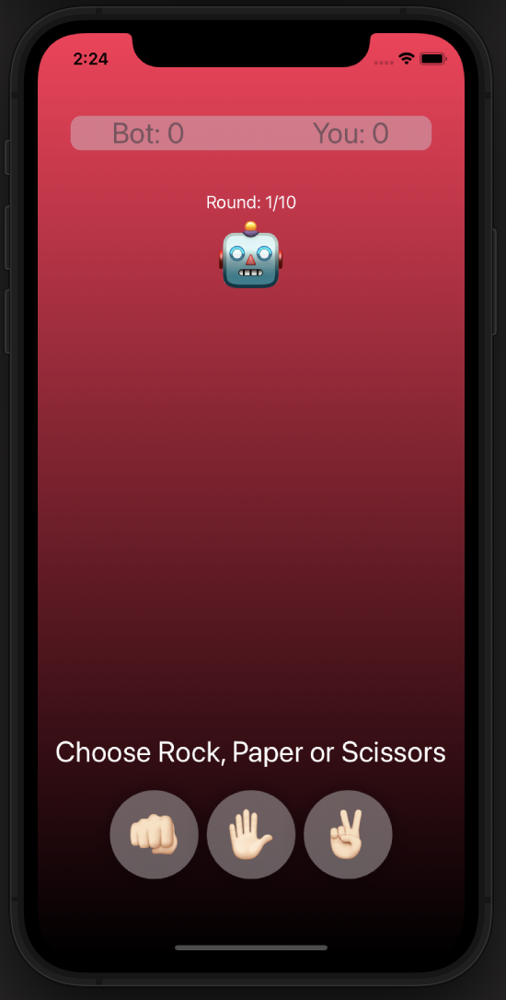
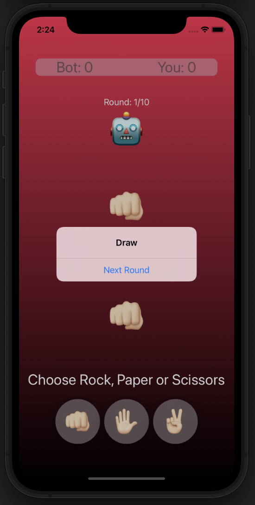
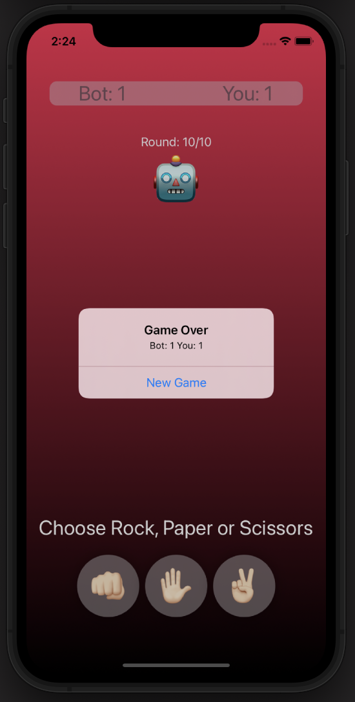

# Rock_paper_scissors

Hi there! Today it is time to post the third project of the course 100 days of SwiftUI, after reaching day 25. On previous days everything was about Views.  Why SwiftUI does prefer Struct to build their views, how modifiers wrap up the views where are applied on building a new one, why the order in which modifiers are applied matters, how create our custom views and our customs modifiers, which can be extended to make easy their using.

To consolidate all this knowledge, we had to build a little game called Rock, Paper and Scissors. On this game, the user can choose between those 3 choices while the computer will randomly pick up one. After comparing the results, the user gets a point in case it wins, or the computer will otherwise.

Despite the scoop of the course, I made some changes on my own:
-	Adopting the MVVM pattern to decouple the logic of the game from the view.
-	Executing a process asynchronously to show the alert message containing the round result, one second after tap the button. This way, the user has time to check his choice and computer’s.

